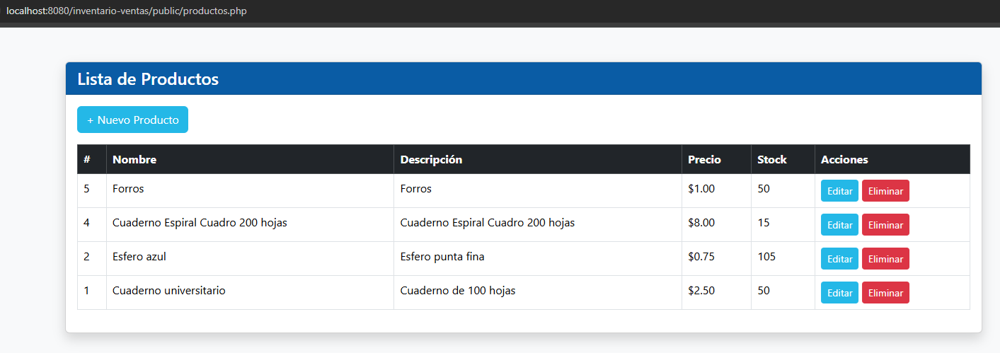
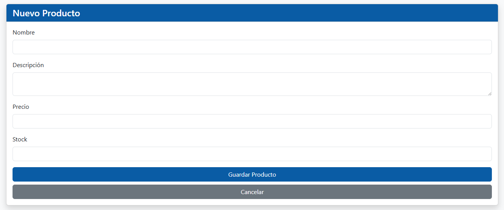
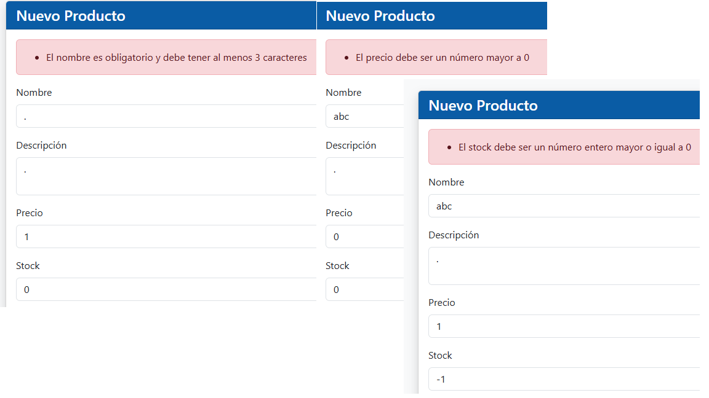
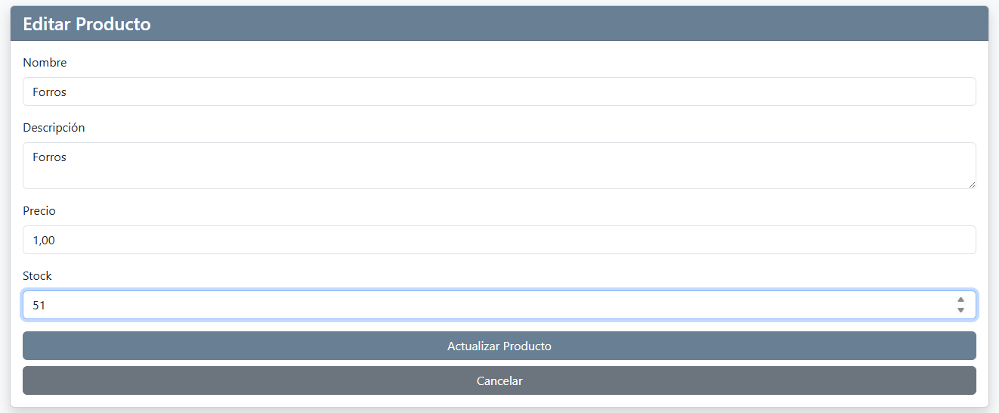
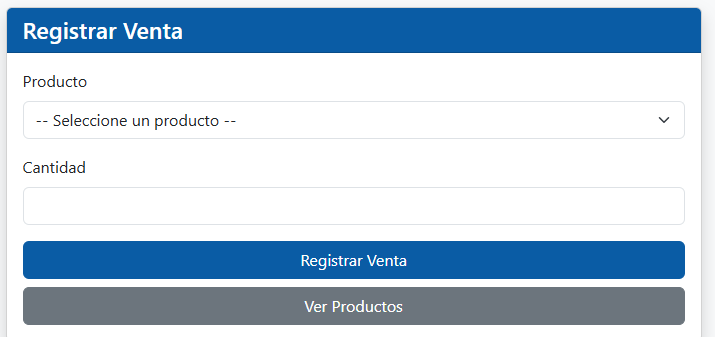
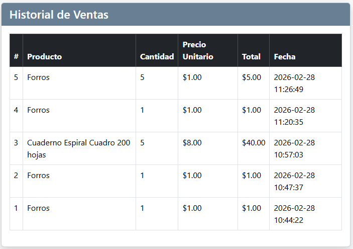
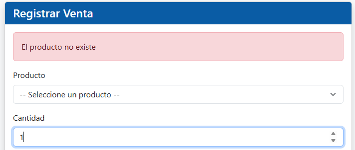
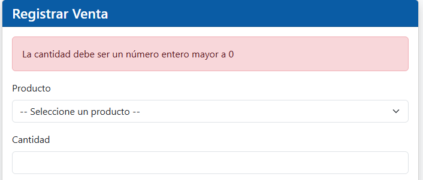
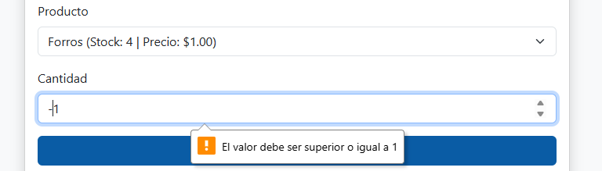
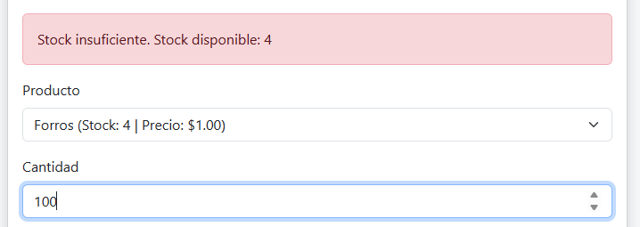

# Sistema de Inventario y Ventas

Sistema web desarrollado en PHP y MySQL para gestionar productos y registrar ventas. 

## Descripción

Este sistema permite llevar el control de productos mediante un CRUD completo.

## Tecnologías usadas

- PHP 8.x
- MySQL 
- Bootstrap 5
- HTML5
- GitHub

## Requisitos

- XAMPP instalado (Apache + MySQL)
- PHP 8
- Navegador web

## Pasos para instalar

1. Clonar el repositorio en la carpeta htdocs de XAMPP:
```
git clone https://github.com/camedina-byte/inventario-ventas.git
```

2. Crear la base de datos en phpMyAdmin ejecutando el script SQL:
```
database/inventario.sql
```

3. Verificar que los datos de conexión en config/database.php sean correctos:
```
host: localhost
usuario: root
password: (vacío en XAMPP por defecto)
base de datos: inventario_ventas
```

4. Abrir el sistema en el navegador:
```
http://localhost:8080/inventario-ventas/public/productos.php
```

## Script SQL
```sql
CREATE DATABASE IF NOT EXISTS inventario_ventas;
USE inventario_ventas;

CREATE TABLE IF NOT EXISTS productos (
    id INT AUTO_INCREMENT PRIMARY KEY,
    nombre VARCHAR(100) NOT NULL,
    descripcion TEXT,
    precio DECIMAL(10,2) NOT NULL,
    stock INT NOT NULL DEFAULT 0,
    created_at TIMESTAMP DEFAULT CURRENT_TIMESTAMP
);

CREATE TABLE IF NOT EXISTS ventas (
    id INT AUTO_INCREMENT PRIMARY KEY,
    producto_id INT NOT NULL,
    cantidad INT NOT NULL,
    precio_unitario DECIMAL(10,2) NOT NULL,
    total DECIMAL(10,2) NOT NULL,
    fecha TIMESTAMP DEFAULT CURRENT_TIMESTAMP,
    FOREIGN KEY (producto_id) REFERENCES productos(id)
);

INSERT INTO productos (nombre, descripcion, precio, stock) VALUES
('Cuaderno universitario', 'Cuaderno de 100 hojas', 2.50, 50),
('Esfero azul', 'Esfero punta fina', 0.75, 100),
('Calculadora', 'Calculadora cientifica basica', 15.00, 20);
```

## Estructura del proyecto
```
/inventario-ventas
├── /config
│   └── database.php
├── /models
│   ├── Producto.php
│   └── Venta.php
├── /controllers
│   ├── ProductoController.php
│   └── VentaController.php
├── /services
│   └── VentaService.php
├── /public
│   ├── index.php
│   ├── productos.php
│   ├── crear_producto.php
│   ├── editar_producto.php
│   ├── eliminar_producto.php
│   └── ventas.php
├── /database
│   └── inventario.sql
├── /screenshots
└── README.md
```

## Funcionalidades

### Módulo Productos
- Listar productos
- Crear producto con validaciones
- Editar producto
- Eliminar producto con confirmación

### Módulo Ventas
- Registrar venta seleccionando producto y cantidad
- Descuento automático de stock al registrar venta
- Validación de stock insuficiente
- Historial de ventas con totales

## Capturas del sistema

### Lista de productos


### Crear producto


### Validaciones


### Editar producto


### Formulario de ventas


### Historial de ventas


### Validaciones de ventas





## Autor

Carlos Medina — Ingeniería en Sistemas Inteligentes — ECOTEC